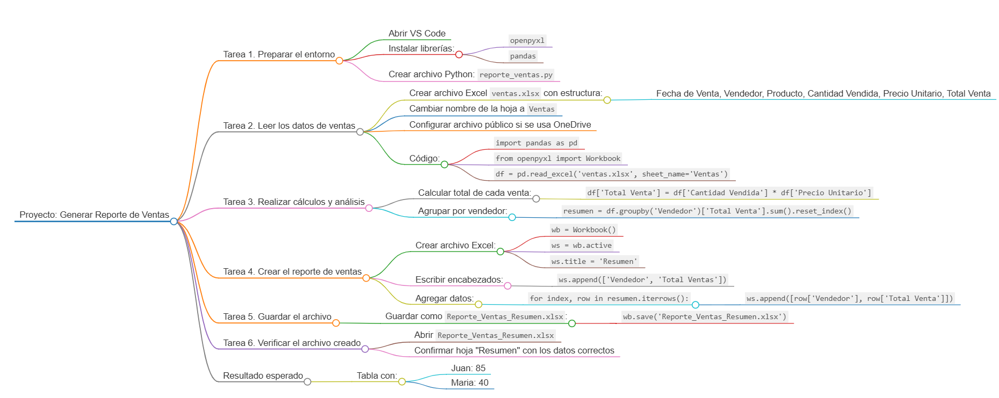
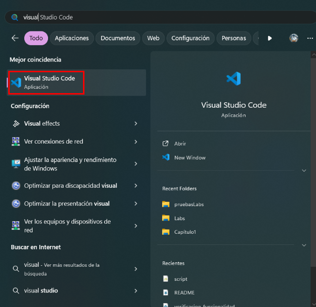
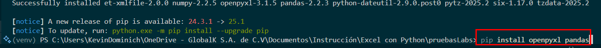
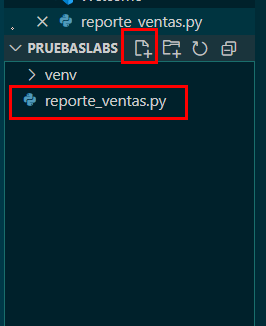
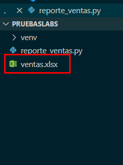
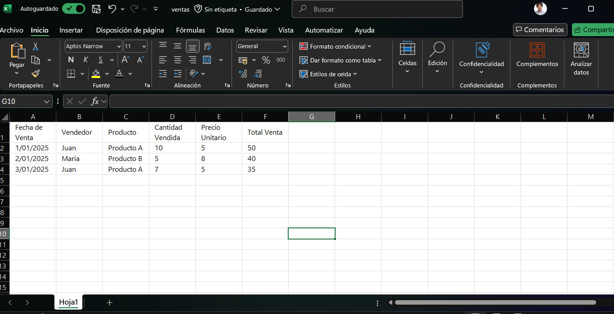
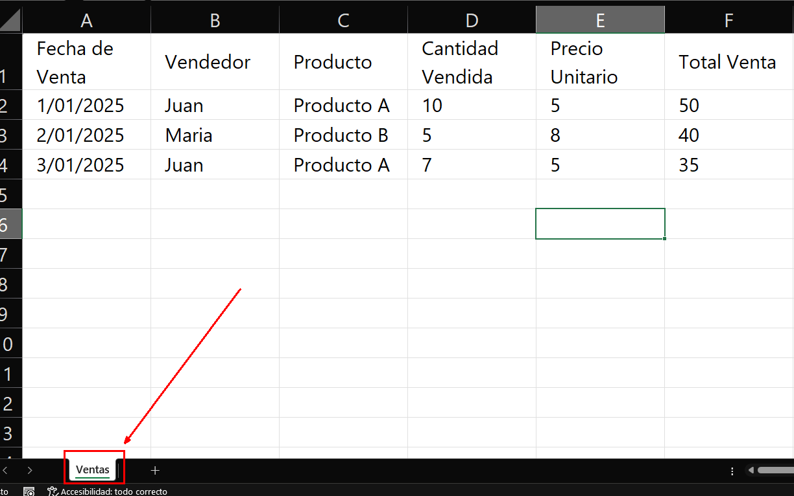
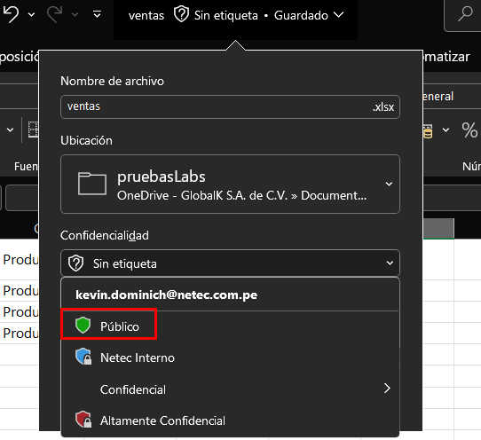
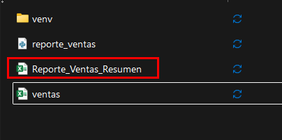
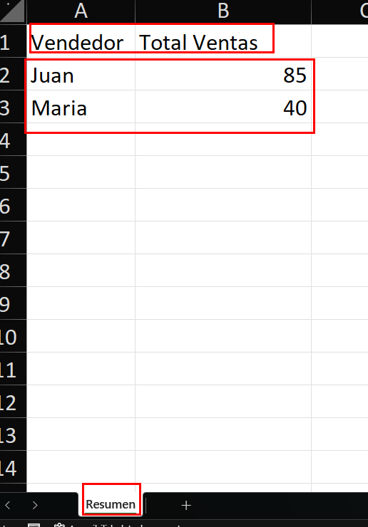

# **Reporte Automático de Ventas**

## Objetivo de la práctica:

Al finalizar la práctica, será capaz de crear un archivo de Excel a partir de datos de ventas, realizar cálculos automáticos y generar un reporte organizado en una hoja nueva.

## Objetivo Visual



## Duración aproximada:

- 40 minutos.

## Instrucciones

### Tarea 1. **Preparar el entorno**

Paso 1. Abre tu editor de código, VS Code.



Paso 2. Instala las librerías `openpyxl` y `pandas` en tu entorno de trabajo con el siguiente comando:

```bash
pip install openpyxl pandas
```



Paso 3. Crea un nuevo archivo Python en VS Code con el nombre `reporte_ventas.py`.



### Tarea 2. **Leer los datos de ventas**

Paso 4. Crea un archivo de Excel llamado `ventas.xlsx` que tiene que estar ubicado en la misma carpeta de `reporte_ventas.py` y coloca la siguiente estructura de datos:

| Fecha de Venta | Vendedor | Producto | Cantidad Vendida | Precio Unitario | Total Venta |
|----------------|----------|----------|------------------|-----------------|-------------|
| 01/01/2025     | Juan     | Producto A| 10               | 5.00            | 50.00       |
| 02/01/2025     | Maria    | Producto B| 5                | 8.00            | 40.00       |
| 03/01/2025     | Juan     | Producto A| 7                | 5.00            | 35.00       |




Paso 5. Cambiar el nombre de la hoja a `Ventas`



Paso 6. En caso de que se maneje el archivo en OneDrive (Para cuentas corporativas de Microsoft) seleccionar que el archivo tenga una etiqueta publica



Paso 7. En el script Python, importa las librerías necesarias:

```python
import pandas as pd
from openpyxl import Workbook
```

Paso 8. Carga los datos del archivo `ventas.xlsx` en un `DataFrame` de `pandas`:

```python
df = pd.read_excel('ventas.xlsx', sheet_name='Ventas')
```

### Tarea 3. **Realizar cálculos y análisis**

Paso 9. Agrega una columna para calcular el total de cada venta multiplicando la cantidad vendida por el precio unitario:

```python
df['Total Venta'] = df['Cantidad Vendida'] * df['Precio Unitario']
```

Paso 10. Agrupa los datos por vendedor y calcula el total de ventas por cada uno:

```python
resumen = df.groupby('Vendedor')['Total Venta'].sum().reset_index()
```

### Tarea 4. **Crear el reporte de ventas**

Paso 11. Crea un nuevo archivo Excel con `openpyxl`:

```python
wb = Workbook()
ws = wb.active
ws.title = 'Resumen'
```

Paso 12. Escribe los encabezados en la hoja "Resumen":

```python
ws.append(['Vendedor', 'Total Ventas'])
```

Paso 13. Agrega los totales de ventas por vendedor a la hoja "Resumen":

```python
for index, row in resumen.iterrows():
    ws.append([row['Vendedor'], row['Total Venta']])
```

### Tarea 5. **Guardar el archivo**

Paso 14. Guarda el archivo Excel con el nombre `Reporte_Ventas_Resumen.xlsx` y ejecuta el codigo:

```python
wb.save('Reporte_Ventas_Resumen.xlsx')
```



### Tarea 6. **Verificar el archivo creado**

Paso 15. Abre el archivo `Reporte_Ventas_Resumen.xlsx` en Excel y verifica que contenga la hoja "Resumen" con los totales de ventas por vendedor.



### Resultado esperado

| Vendedor | Total Ventas |
|----------|--------------|
| Juan     | 85      |
| Maria    | 40        |
