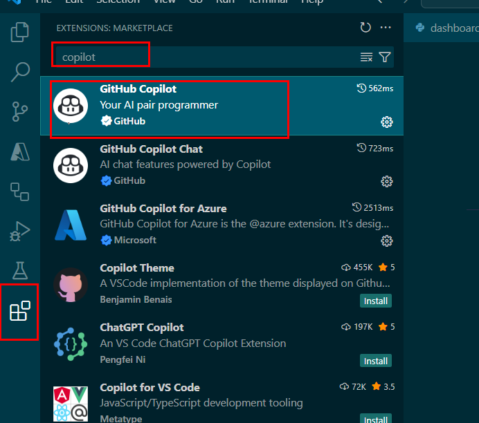
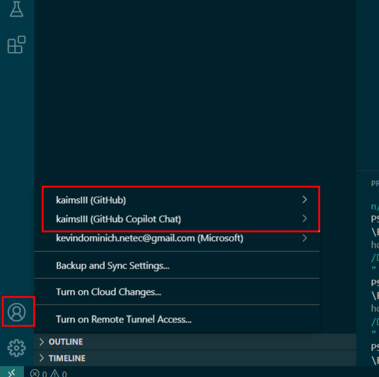
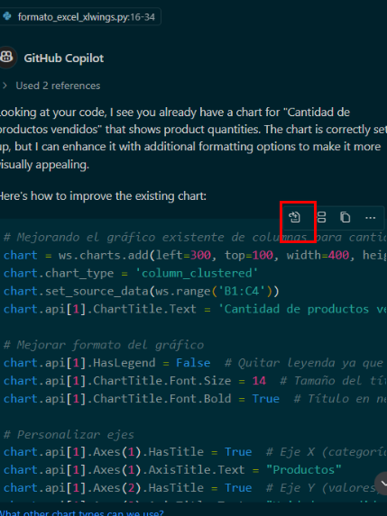
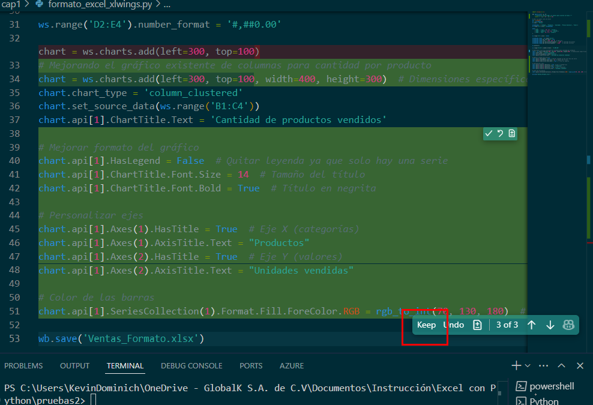
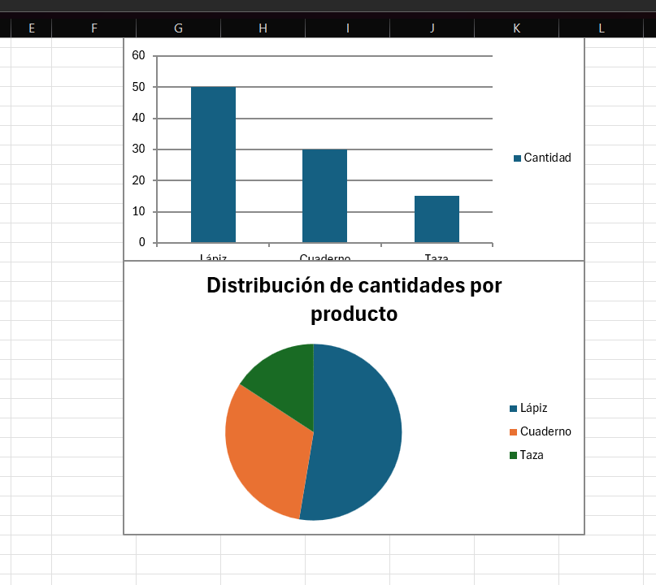
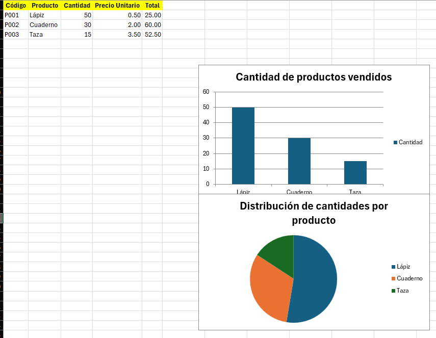

# Práctica 2. Aplicación de formatos en celdas, tablas y gráficos desde Python

## Objetivo de la práctica:

Al finalizar la práctica, será capaz de:
- Aplicar formatos personalizados a celdas y tablas de Excel.
- Crear un gráfico desde Python utilizando exclusivamente la librería `xlwings`.

## Objetivo visual


## Duración aproximada:
- 40 minutos.

## Instrucciones

### Tarea 1. **Preparar el entorno**

Paso 1. Abrir el editor de código, VS Code.

Paso 2. Instalar la librería `xlwings` con el siguiente comando:

```bash
pip install xlwings
```


Paso 3. Crear un nuevo archivo Python en VS Code y guardarlo como `formato_excel_xlwings.py`.


### Tarea 2. **Crear y llenar un archivo Excel**

**IMPORTANTE: Para cada nueva ejecución, se abrirá un nuevo archivo de Excel. Cerrar las versiones anteriores de esos libros.**

Paso 4. Escribir el siguiente código para iniciar un libro nuevo de Excel y activar la hoja:

```python
import xlwings as xw

# Abrir un nuevo libro de Excel
wb = xw.Book()
ws = wb.sheets[0]
ws.name = 'Ventas'
```


Paso 5. Insertar los encabezados de la tabla:

```python
encabezados = ['Código', 'Producto', 'Cantidad', 'Precio Unitario', 'Total']
ws.range('A1').value = encabezados
```


Paso 6. Agregar los datos de productos en las filas siguientes:

```python
datos = [
    ['P001', 'Lápiz', 50, 0.5, '=C2*D2'],
    ['P002', 'Cuaderno', 30, 2.0, '=C3*D3'],
    ['P003', 'Taza', 15, 3.5, '=C4*D4']
]

ws.range('A2').value = datos
```


### Tarea 3. **Aplicar formato a celdas y tabla**

Paso 7. Dar formato de negrita, color de fondo y centrar los encabezados:

```python
encabezado_rango = ws.range('A1:E1')
encabezado_rango.api.Font.Bold = True
encabezado_rango.color = (255, 255, 0)  # amarillo
encabezado_rango.api.HorizontalAlignment = -4108  # centrado horizontal
encabezado_rango.api.VerticalAlignment = -4108    # centrado vertical
```


Paso 8. Ajustar el ancho de las columnas automáticamente:

```python
ws.autofit()
```


Paso 9. Dar formato numérico con dos decimales a las columnas "Precio Unitario" y "Total":

```python
ws.range('D2:E4').number_format = '#,##0.00'
```


### Tarea 4. **Crear un gráfico en Excel**

Paso 10. Crear un gráfico de columnas con los datos de cantidad por producto:

```python
chart = ws.charts.add(left=300, top=100)
chart.chart_type = 'column_clustered'
chart.set_source_data(ws.range('B1:C4'))
chart.api[1].ChartTitle.Text = 'Cantidad de productos vendidos'
```


### Tarea 5. **Guardar el archivo y cerrar Excel**

Paso 11. Se guardara el archivo con el nombre `Ventas_Formato.xlsx`:

```python
wb.save('Ventas_Formato.xlsx')
```


### Tarea 6. **Verificar el archivo**

Paso 12. Abrir el archivo `Ventas_Formato.xlsx` desde el explorador de archivos.

Paso 13. Revisar que tenga:
- Encabezados con color de fondo amarillo y centrados.
- Datos con fórmulas activas.
- Precios y totales con formato de moneda o dos decimales.
- Un gráfico con la cantidad de productos vendidos.


### Tarea 7. Uso de GitHub Copilot para generar código

Paso 14. Para conseguir la integración de GitHub Copilot en VS Code, seguir los siguientes pasos:

- Instalar la extensión GitHub Copilot entrando al `mercado de extensiones de VS Code > Escribe Copilot en la barra de búsqueda > Instala las extensiones de GitHub Copilot y GitHub Copilot Chat`.




- Iniciar sesión con tu cuenta de GitHub para activar la extensión.



Paso 15. Generar un código con la siguiente solicitud `Crear un gráfico circular para los datos de cantidad por producto`.


Paso 16. Seleccionar la opción de `Aplicar en el editor` y aceptar los cambios una vez los termine de realizar.




Paso 17. Abrir el archivo de Excel y verificar el resultado obtenido con la modificación solicitada a GitHub Copilot.



### Resultado esperado


