# **Importación y exportación de datos entre Excel, CSV, JSON y SQLite**

## Objetivo de la práctica:

Al finalizar esta práctica, será capaz de importar datos desde archivos CSV y JSON, manipularlos con `pandas`, y exportarlos tanto a Excel como a una base de datos SQLite. Todo se realizará con un script en Python usando VS Code en Windows.

## Objetivo Visual

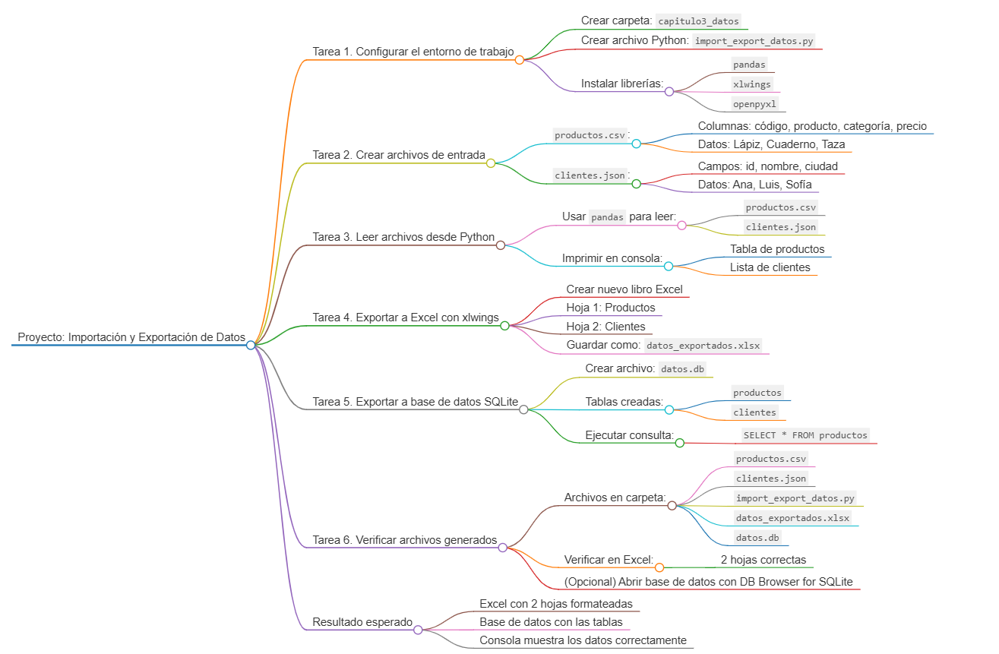

## Duración aproximada:
- 45 minutos.

---

## Instrucciones

### Tarea 1. **Configurar el entorno de trabajo**

Paso 1. Crea una carpeta dentro de VsCode llamada `capitulo3_datos`

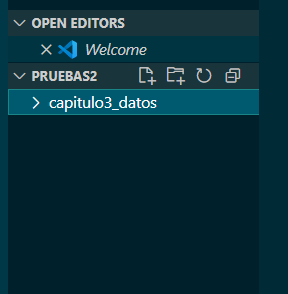

Paso 2. Crea un archivo Python en esa carpeta, para ello haz clic derecho sobre la carpeta → **Nuevo archivo** → nómbralo `import_export_datos.py`.

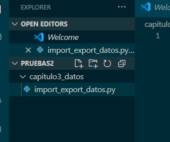

Paso 3. Instala las librerías necesarias. Abre la terminal en VS Code con `Ctrl + ñ` y escribe este comando:

```bash
pip install pandas xlwings openpyxl
```

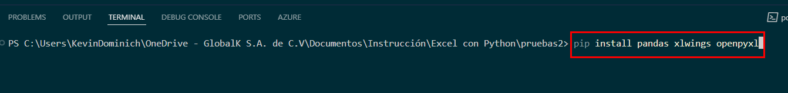

---

### Tarea 2. **Crear los archivos de entrada (CSV y JSON)**

Paso 4. Crear el archivo `productos.csv`
1. Haz clic derecho sobre la carpeta → **Nuevo archivo** → nómbralo `productos.csv`.

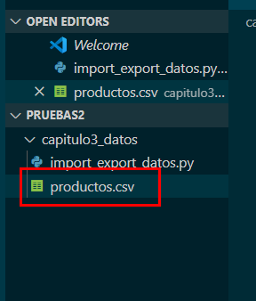

2. Coloca este contenido en el archivo csv y guardalo:

```csv
codigo,producto,categoria,precio
P001,Lápiz,Papelería,0.5
P002,Cuaderno,Papelería,2.0
P003,Taza,Hogar,3.75
```

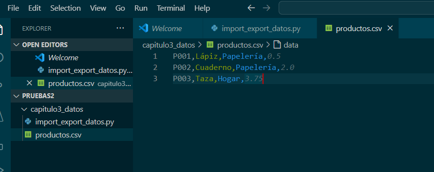

Paso 5. Crear el archivo `clientes.json`
1. Haz clic derecho → **Nuevo archivo** → nómbralo `clientes.json`.

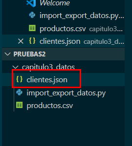

2. Coloca este contenido en el archivo json y guardalo:

```json
[
  {"id": 1, "nombre": "Ana", "ciudad": "Bogotá"},
  {"id": 2, "nombre": "Luis", "ciudad": "Medellín"},
  {"id": 3, "nombre": "Sofía", "ciudad": "Cali"}
]
```

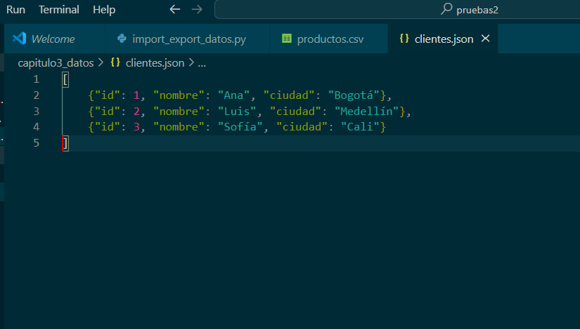

---

### Tarea 3. **Leer los archivos desde Python usando pandas**

Paso 6. Abre el archivo `import_export_datos.py` y escribe:

```python
import pandas as pd

# Leer datos desde CSV
productos = pd.read_csv('capitulo3_datos\\productos.csv')

# Leer datos desde JSON
clientes = pd.read_json('capitulo3_datos\\clientes.json')

# Imprimir resultados en consola
print("Productos:")
print(productos)

print("\nClientes:")
print(clientes)
```

Paso 7. Ejecutar el archivo para visualizar los datos cargados correctamente en la terminal.

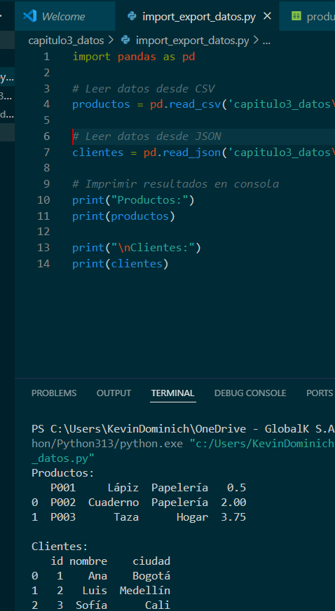

---

### Tarea 4. **Exportar los datos a Excel usando xlwings**

Paso 8. Añade el siguiente bloque de código:

```python
import xlwings as xw

# Crear un libro nuevo en Excel
wb = xw.Book()  # Abre Excel con un libro nuevo

# Agregar productos a la primera hoja
ws1 = wb.sheets[0]
ws1.name = 'Productos'
ws1.range('A1').value = productos

# Crear otra hoja para clientes
ws2 = wb.sheets.add('Clientes')
ws2.range('A1').value = clientes

# Guardar el archivo
wb.save('datos_exportados.xlsx')
```

Paso 9. Ejecuta el script nuevamente
- Excel se abrirá automáticamente.
- Se creará un archivo llamado `datos_exportados.xlsx` en tu carpeta.
- Verifica que haya dos hojas: “Productos” y “Clientes”.

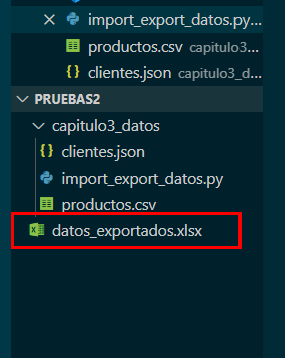

---

### Tarea 5. **Guardar los datos en una base de datos SQLite**

Paso 10. Cerrar los archivos de Excel abiertos, y agrega este bloque al final del archivo:

```python
import sqlite3

# Crear la base de datos (si no existe)
conn = sqlite3.connect('datos.db')

# Exportar los datos a SQLite
productos.to_sql('productos', conn, if_exists='replace', index=False)
clientes.to_sql('clientes', conn, if_exists='replace', index=False)

# Verificar una consulta simple
consulta = pd.read_sql_query('SELECT * FROM productos', conn)
print("\nConsulta desde la base de datos:")
print(consulta)

conn.close()
```

Paso 11. Ejecuta el script
- Se creará un archivo `datos.db` en tu carpeta.
- La terminal mostrará los datos consultados desde la base de datos.


---

### Tarea 6. **Verificar los archivos generados**

Paso 12. Asegúrate de tener en tu carpeta:

- `productos.csv`  
- `clientes.json`  
- `import_export_datos.py`  
- `datos_exportados.xlsx` (archivo Excel generado)  
- `datos.db` (base de datos SQLite)

Paso 13. Abre el archivo Excel
- Verifica que las dos hojas estén correctamente formateadas.

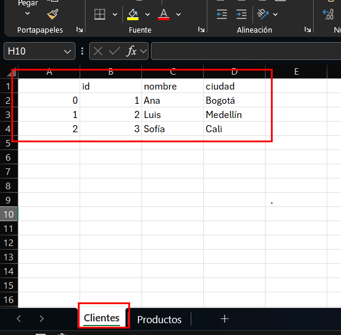
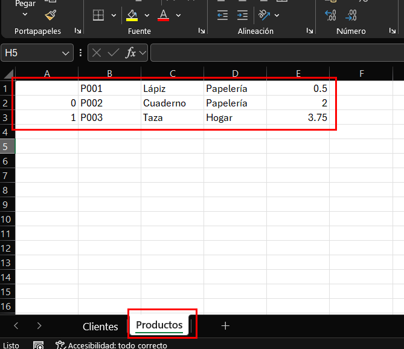

Paso 14. (Opcional) Abre la base de datos con un visor SQLite (como [DB Browser for SQLite](https://sqlitebrowser.org/)) si quieres ver las tablas.

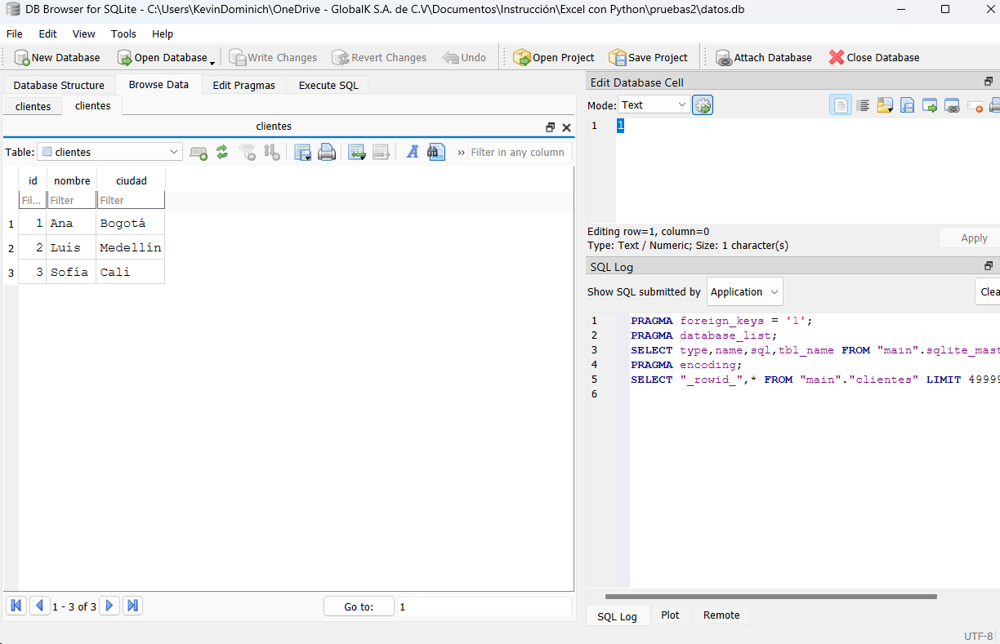
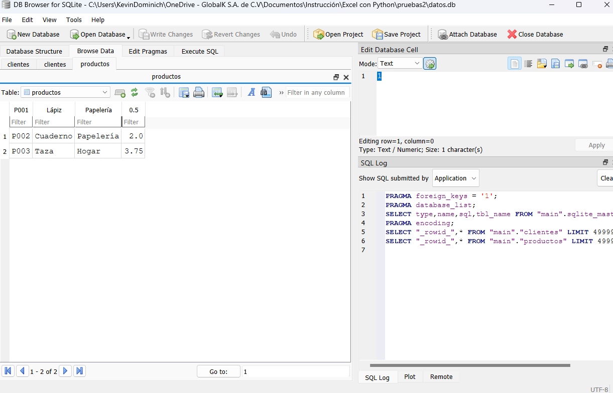

---

### Resultado esperado


