# Práctica 4. Dashboard de clientes por región con gráficos dinámicos

## Objetivo de la práctica:

Al finalizar la práctica, será capaz de:
- Importar datos de clientes desde un archivo Excel, analizarlos con `pandas`, agruparlos por región, calcular KPIs como monto total, ticket promedio y volumen de compras, así como generar gráficos automáticos con `matplotlib` usando `xlwings` para integrarlos en un archivo Excel final.

## Objetivo visual

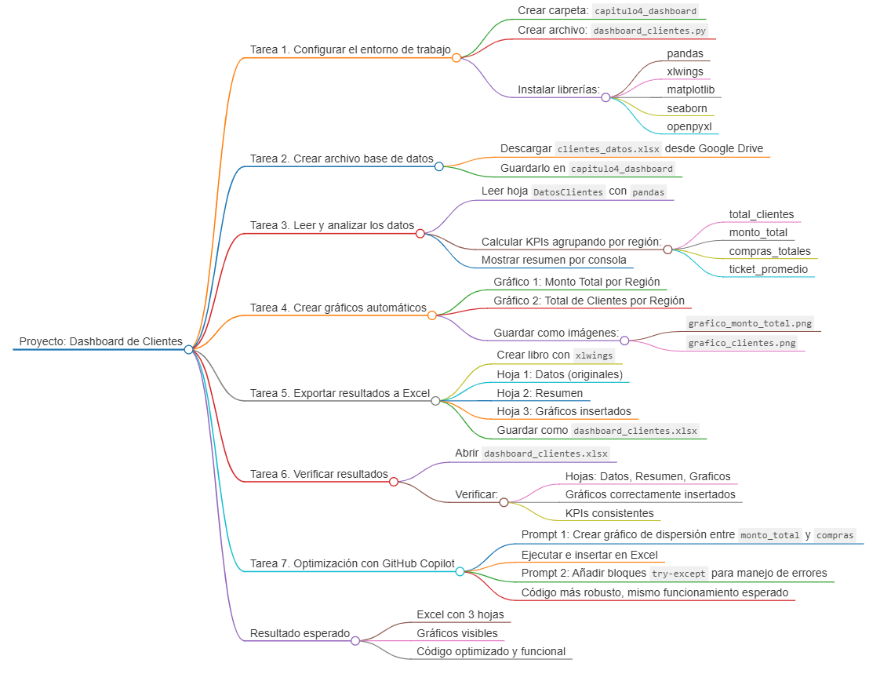

## Duración aproximada:
- 40 minutos.

---

## Instrucciones

### Tarea 1. **Configurar el entorno de trabajo**

Paso 1. Crear una carpeta en VS Code llamada `capitulo4_dashboard`.

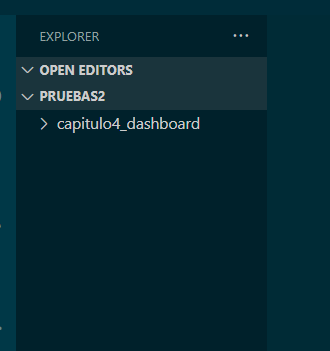

Paso 2. Dentro de esa carpeta, crear un archivo Python llamado `dashboard_clientes.py`.

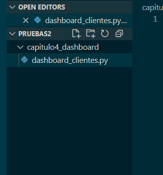

Paso 3. Instalar las librerías necesarias con este comando en la terminal:

```bash
pip install pandas xlwings matplotlib seaborn openpyxl
```

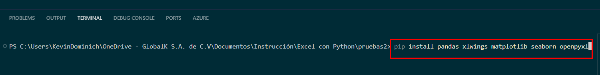

---

### Tarea 2. **Crear el archivo de datos base en Excel**

Paso 4. Descargar el archivo `clientes_datos.xlsx` del siguiente enlace 
`https://docs.google.com/spreadsheets/d/1AWQ_fzq19RH2cO3OajvWd9CDXZGuWJYK/edit?usp=sharing&ouid=115294151315643663941&rtpof=true&sd=true`

Hacer clic en `Archivo > Descargar > Microsoft Excel (.xlsx)`.

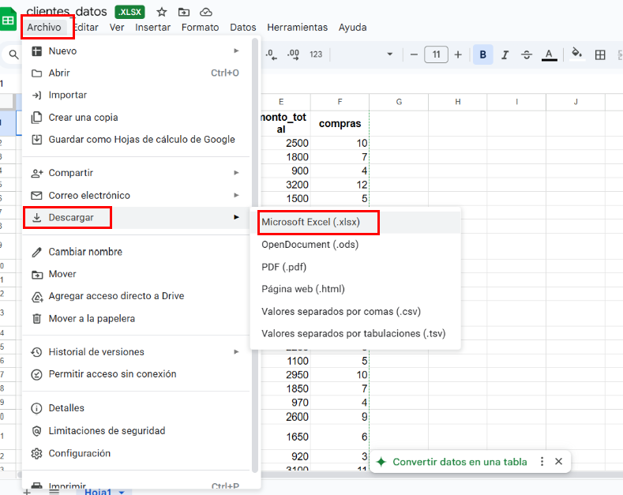

Y ubicarlo en la carpeta `capitulo4_dashboard`.

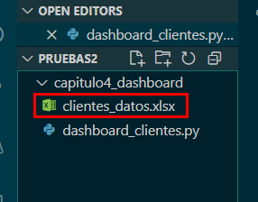

---

### Tarea 3. **Leer y analizar los datos**

Paso 5. En el archivo `dashboard_clientes.py`, escribir:

```python
import pandas as pd
import numpy as np
import matplotlib.pyplot as plt
import xlwings as xw
import os

# Obtener el directorio actual donde se ejecuta el script
directorio_actual = os.path.dirname(os.path.abspath(__file__))

# Leer archivo de Excel
clientes = pd.read_excel('capitulo4_dashboard\\clientes_datos.xlsx', sheet_name='DatosClientes')

# Agrupar por región y calcular KPIs
resumen = clientes.groupby('region').agg(
    total_clientes=('id', 'count'),
    monto_total=('monto_total', 'sum'),
    compras_totales=('compras', 'sum'),
    ticket_promedio=('monto_total', 'mean')
).reset_index()

print(resumen)
```

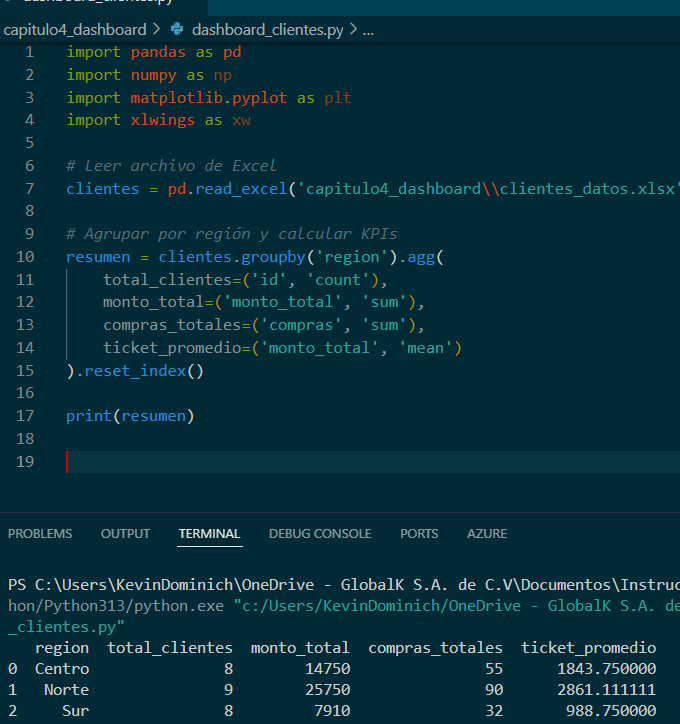

---

### Tarea 4. **Crear gráficos automáticos**

Paso 6. Añadir el siguiente bloque para los gráficos:

```python
ruta_grafico1 = os.path.join(directorio_actual, 'grafico_monto_total.png')
ruta_grafico2 = os.path.join(directorio_actual, 'grafico_clientes.png')

# Generar gráfico 1: Monto total por región
plt.figure(figsize=(8, 6))
plt.bar(resumen['region'], resumen['monto_total'], color='skyblue')
plt.title('Monto Total por Región')
plt.xlabel('Región')
plt.ylabel('Monto Total')
plt.savefig(ruta_grafico1)  
plt.close()

# Generar gráfico 2: Total de clientes por región
plt.figure(figsize=(8, 6))
plt.bar(resumen['region'], resumen['total_clientes'], color='lightgreen')
plt.title('Total de Clientes por Región')
plt.xlabel('Región')
plt.ylabel('Total de Clientes')
plt.savefig(ruta_grafico2)  
plt.close()
```

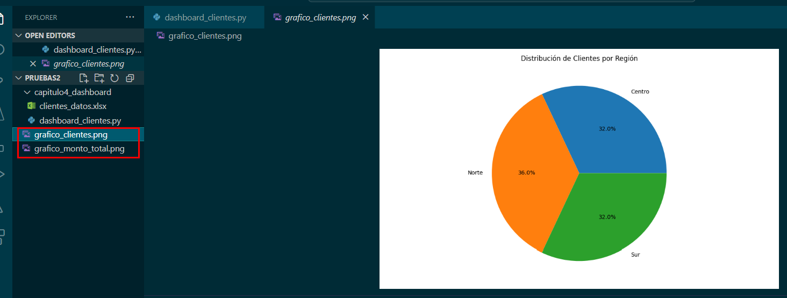   
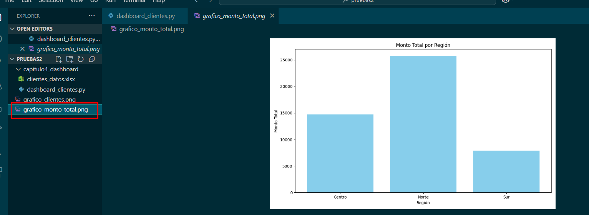  

---

### Tarea 5. **Exportar resultados a Excel con xlwings**

Paso 7. Agregar este bloque al final del script:

```python
wb = xw.Book()

# Hoja 1: Datos crudos
hoja_datos = wb.sheets[0]
hoja_datos.name = 'Datos'
hoja_datos.range('A1').value = clientes

# Hoja 2: Resumen
hoja_resumen = wb.sheets.add('Resumen')
hoja_resumen.range('A1').value = resumen

# Hoja 3: Gráficos
hoja_graficos = wb.sheets.add('Graficos')
hoja_graficos.pictures.add(ruta_grafico1, name='Grafico1', update=True, left=hoja_graficos.range('A1').left)
hoja_graficos.pictures.add(ruta_grafico2, name='Grafico2', update=True, left=hoja_graficos.range('A20').left)

# Guardar el archivo Excel en el directorio del script
ruta_excel = os.path.join(directorio_actual, 'dashboard_clientes.xlsx')
wb.save(ruta_excel)
wb.close()
```  

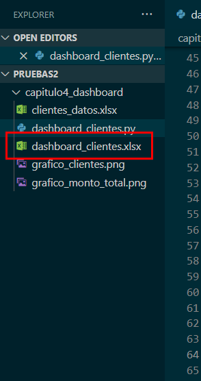

---

### Tarea 6. **Verificar resultados**

Paso 8. Abrir el archivo `dashboard_clientes.xlsx` generado:

- Verificar que haya tres hojas: Datos, Resumen y Graficos.
- Observar que los gráficos estén bien posicionados.
- Asegúrate de que los datos del resumen coincidan con los datos originales.

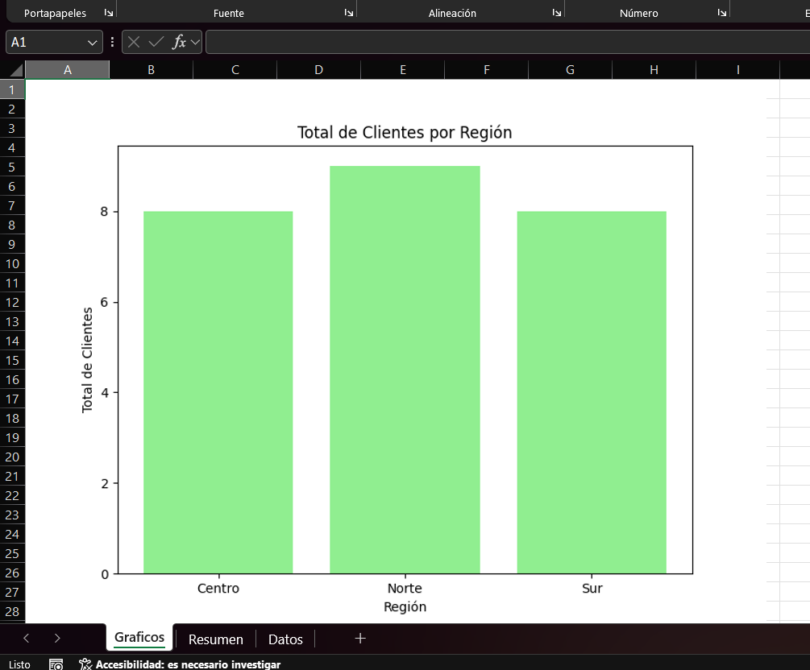
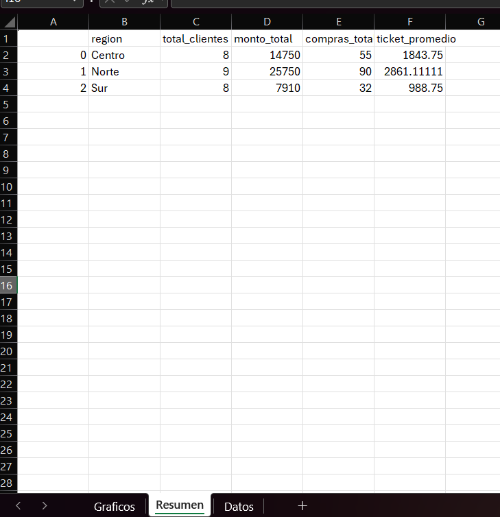
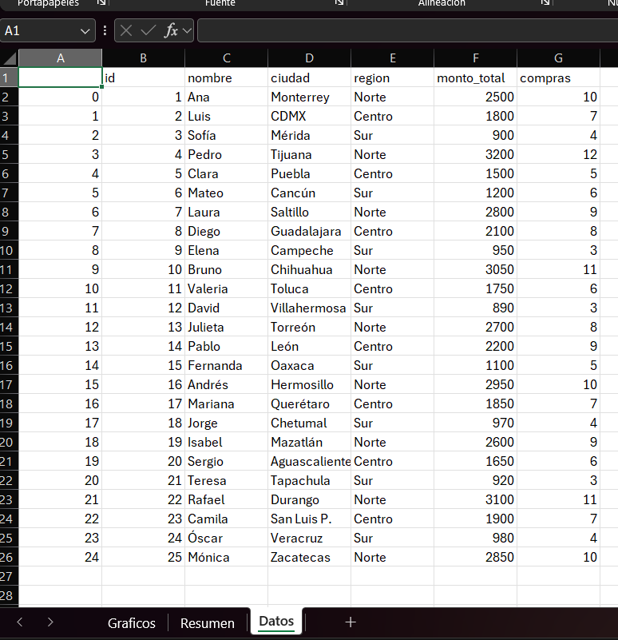

---

### Tara 7. **Optimizacion con GitHub Copilot**

Paso 9. Colocar el siguiente prompt en GitHub Copilot `Crear un gráfico de dispersión entre 'monto_total' y 'compras'`

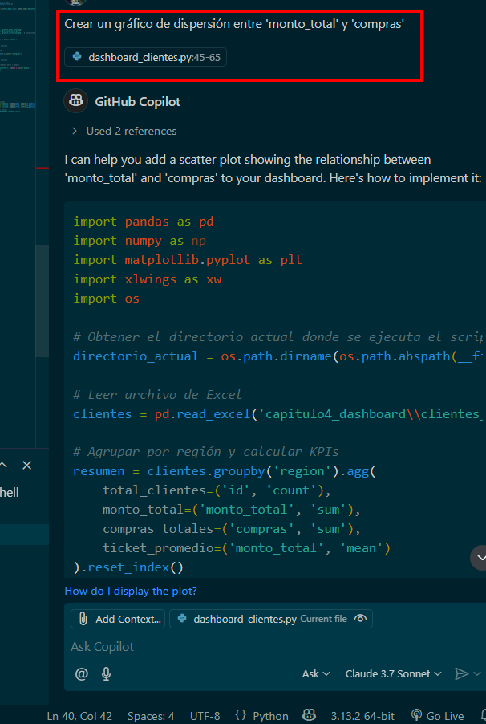

Paso 10. Insertar el codigo generado y al ejecutarlo, debe generar una nueva imagen con el gráfico.

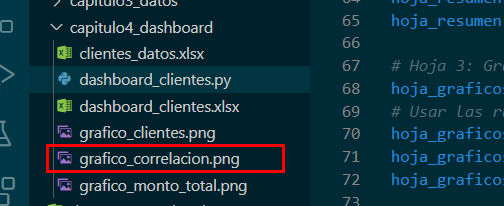

Paso 11. Abrir el archivo `dashboard_clientes.xlsx` generado y verificar que el gráfico se muestre correctamente.

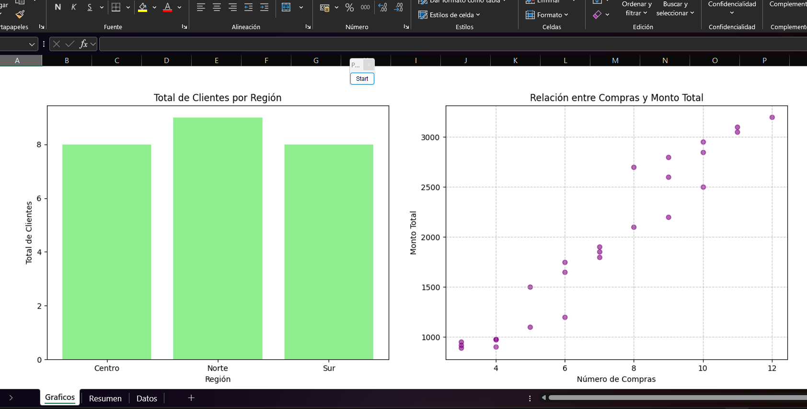

Paso 12. Colocar el siguiente prompt en GitHub Copilot para mejorar la calidad del codigo `Modifica el codigo para añadir bloques try-except alrededor de la lectura de los Excel y las exportaciones finales`

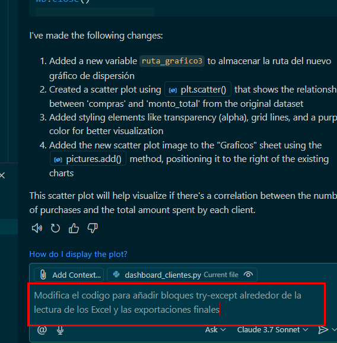

Paso 13. Insertar el código generado, teniendo un código más robusto al manejar excepciones, y al ejecutarlo, el funcionamiento debe dar los mismos resultados.

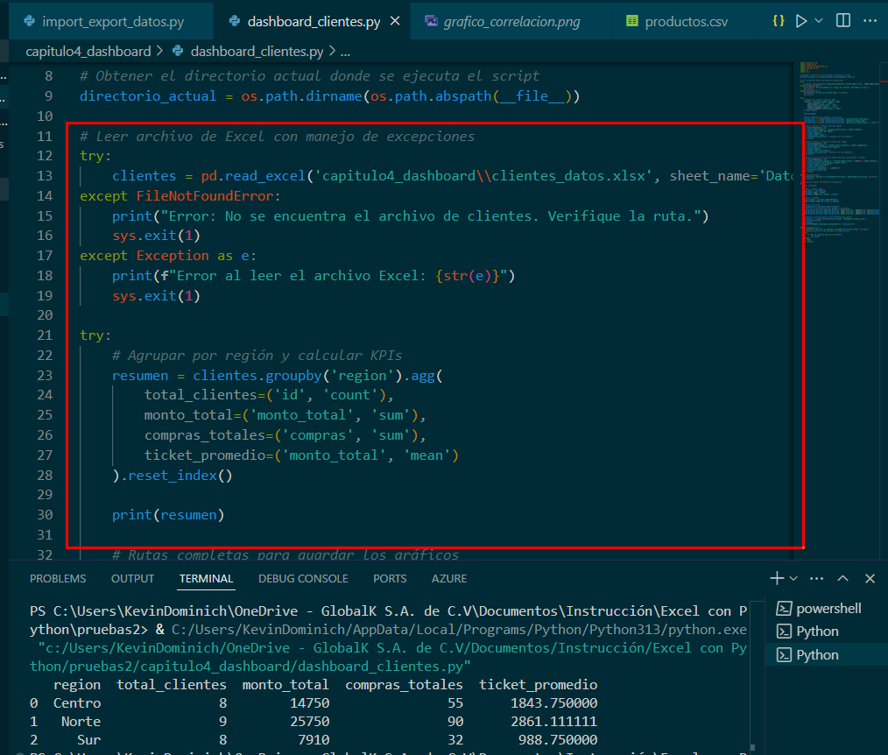

### Resultado esperado


